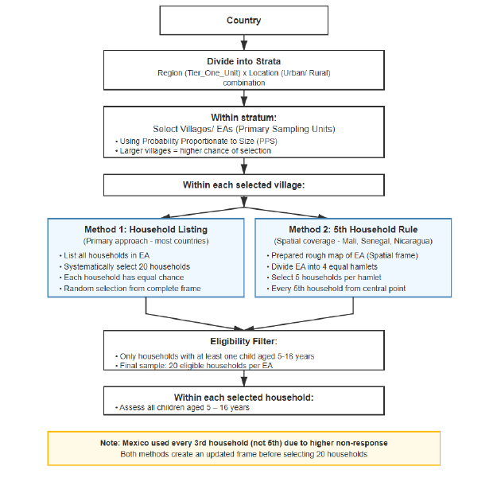

```{r, setup1, include=FALSE}
knitr::opts_chunk$set(
  warnings = FALSE,
  fig.path = 'figs/', 
  message = F
)

library(knitr)
library(cowplot) #Gives more control for figures
```

# Introduction

```{js, echo = FALSE}
title=document.getElementById('header');
title.innerHTML = '' + title.innerHTML
```


<!--chapter:end:index.Rmd-->

# Survey Design, Sampling, and Weighting

Household surveys such as PAL Network’s ICAN-ICAR study estimate population learning outcomes from a sample. The sampling design determines *which* households enter the data, and the survey design variables (weights, strata, and clusters) determine *how* analysts should estimate population quantities and uncertainty. After this chapter, you should be able to explain probability sampling, describe the ICAN-ICAR multi-stage design, interpret a survey weight, and compute design-correct estimates in R.

```{r}

#| echo: true
#| warning: false
#| message: false

library(tidyverse)
library(survey)
library(knitr)

# load the data
dat = read_csv("data/2025_PAL_ICAN-ICAR_data.csv", show_col_types = FALSE)

```

## Survey sampling and design

A census measures every household in the population. ICAN-ICAR survey data instead uses a probability sample because a census is rarely feasible at national scale. Probability sampling supports population inference because the design assigns each unit a known (or estimable) selection probability.

ICAN-ICAR survey data uses a stratified, multi-stage cluster design.@fig-pal-sampling-process illustrates the logic.

```{r}
#| label: fig-pal-sampling-process
#| echo: false
#| fig-cap: "Illustration of the ICAN-ICAR multi-stage sampling process."
#| out-width: "100%"


```

**Stage 1 (select clusters).** The survey defines primary sampling units (PSUs) such as enumeration areas, villages, or urban blocks. Within strata (for example, region-by-urban/rural categories), the design selects PSUs using probability proportional to size (PPS) so that larger PSUs have a higher chance of selection.

**Stage 2 (select households).** Within each selected PSU, the field team selects a fixed number of households using a standardized selection procedure (for example, systematic selection from a listing). This second stage produces the household sample used for data collection.

This design shapes analysis in two ways. First, learners within the same PSU tend to resemble one another, which increases uncertainty relative to a simple random sample of the same size. Second, stratification often improves precision because the sample covers key sub-populations more evenly.

## Survey weights and design-based inference

A survey weight approximates how many population units a sampled unit represents. In its simplest form, the design weight equals the inverse of the selection probability. If a household had a 1 in 500 chance of selection, its basic weight would be 500. In other words, that household represents 500 households in the population.The ICAN-ICAR survey data includes a household weight variable, `HH_Weight_Provided`, which can be used for population estimate.

To compensate for households that were selected but did not respond (or were missed), the weights are adjusted so that responding households “stand in” for similar households that did not respond. This may also involve post-stratification — adjusting weights so
that certain known totals (e.g. population by region, or by urban/rural) align with census figures. These adjustments reduce bias from non-response and any sampling frame imperfections.


Ignoring survey weights or clustering can make your analysis misrepresent both the population estimate and its uncertainty. If selection probabilities vary, unweighted summaries describe the sample rather than the population, whereas weighting targets the population by rebalancing each observation's contribution. Clustering also induces correlation within PSUs, thus treating the data as a random sample typically understates standard errors and produces confidence intervals that are too narrow. Survey-aware methods incorporates the design to estimate uncertainty correctly.

The `svydesign()` from the `survey` package represents the sampling design through a design object. After you create that object, you pass it to survey-aware estimators such as `svymean()` and `svyglm()`. In multi-country analysis, cluster and strata identifiers can repeat across countries. The safest approach is to use `interaction()` so that identifiers become unique across the pooled data.

```{r}
#| eval: false

options(
  survey.lonely.psu = "adjust",
  survey.adjust.domain.lonely = TRUE
)

des = svydesign(
  ids     = ~interaction(CountryName, VillageID) + HHID,
  strata  = ~interaction(CountryName, Tier_One_Unit),
  weights = ~HH_Weight_Provided,
  data    = dat,
  nest    = TRUE
)
```

Let's break down each component:

**1. `ids = ~interaction(CountryName, VillageID) + HHID`**

This specifies the **two-stage cluster structure**:

-   **Stage 1:** EAs/Villages (identified uniquely by `interaction(CountryName, VillageID)`)
-   **Stage 2:** Households within EAs (identified by `HHID`)

We use `interaction()` to create unique EA identifiers across countries, since the same `VillageID` might exist in multiple countries. The `+` indicates nested stages (households within EAs)

**2. `strata = ~interaction(CountryName, Tier_One_Unit)`**

Stratification variables are the geographic regions within each country. `Tier_One_Unit` represents the first-level administrative division (provinces, districts, etc.). We interact this with `CountryName` to treat each country as its own separate stratification system. This ensures that sampling variability is calculated correctly within each country's design

**3. `weights = ~HH_Weight_Provided`**

This is the final household weight variable provided in the data. Already incorporates all necessary adjustments (selection probabilities, non-response, post-stratification)

**4. `nest = TRUE`**

This is essential when cluster IDs are only unique within strata. It tells R that `VillageID` values can repeat across different strata/countries, and prevents R from treating EAs with the same ID in different countries as the same cluster.

The example below compares an unweighted and weighted estimate of the proportion of enrolled learners who meet minimum proficiency in both maths and reading in Senegal.

```{r}
#| label: compare weighted and unweighted
#| warning: false
#| message: false

# filter to enrolled learners in Senegal
one_country = dat |>
  filter(CountryName == "Senegal" & enr_status == "Currently Enrolled")

# unweighted (sample) estimate
prop_unweighted = mean(one_country$MPL_both, na.rm = TRUE)
prop_unweighted
```


```{r}

# weighted estimate with design-correct SE
options(
  survey.lonely.psu = "adjust",
  survey.adjust.domain.lonely = TRUE
)

des_one = svydesign(
  ids     = ~interaction(CountryName, VillageID) + HHID,
  strata  = ~interaction(CountryName, Tier_One_Unit),
  weights = ~HH_Weight_Provided,
  data    = one_country,
  nest    = TRUE
)


prop_weighted = svymean(~MPL_both, design = des_one, na.rm = TRUE)
prop_weighted
```

@fig-pal-analysis-workflow summarizes a practical workflow that you can reuse for descriptive statistics and modelling.

```{r}
#| label: fig-pal-analysis-workflow
#| echo: false
#| fig-cap: "A practical workflow for analysing ICAN-ICAR survey data in R."
#| out-width: "85%"

knitr::include_graphics("figs/analysisflow_pal.png")
```

After you define `des`, these are the common *survey-aware* functions:

-   `svymean()` for weighted means and proportions,
-   `svytotal()` for weighted totals,
-   `svyby()` for subgroup estimates, and
-   `svyglm()` for regression models with design-correct standard errors.

## Practice exercises

1.  Change the country filter in the example and compare unweighted and weighted MPL estimates.
2.  Estimate the weighted proportion meeting MPL in maths (`MPL_math`) and compare it with the unweighted proportion.
3.  Within one country, use `svyby()` to estimate MPL by `Location` (urban/rural) for enrolled learners.

<!--chapter:end:01-survey-design-sampling-weighting.Rmd-->

# Understanding distributions

Large survey datasets contain many variables and many observations. To learn from such data, you need tools that summarise patterns clearly and accurately. This chapter introduces distributions—the way a variable’s values are spread across the sample—and shows how to describe distributions using tables, summary statistics, and simple plots. Because the ICAN-ICAR data come from a complex survey, we also show how to produce weighted summaries that reflect the target population.

```{r}
#| label: load-packages
#| echo: false
#| warning: false
#| message: false

library(tidyverse)
library(survey)
library(knitr)

# load the data
dat = read_csv("data/2025_PAL_ICAN-ICAR_data.csv")

# keep observations with a valid household weight
dat = dat |>
  filter(!is.na(HH_Weight_Provided))
```

## Getting oriented to the data

Start by checking the size of the dataset and inspecting the variables.

```{r}
#| label: quick-checks
#| warning: false
#| message: false

dim(dat)       # rows and columns
names(dat)[1:25]  # first 25 variable names
```

A useful next step is to focus on a small set of variables. In this course we frequently use child age (`ch02`), child sex (`ch03`), enrolment status (`enr_status`), and assessment timing variables.

```{r}
#| label: select-key-variables
#| warning: false
#| message: false

dat |>
  select(CountryName, Location, HHID, ChildID,
         ch02, ch03, ch06a, enr_status,
         icar_assess_time, ican_assess_time) |>
  head(10)
```

## Variable types and levels of measurement

The summary tools you use depend on the type of variable.

**Continuous (or continuous-like) variables** represent quantities. Examples include child age (`ch02`), household size (`hh06a`), and assessment time (`icar_assess_time`). Even when a variable records whole numbers (such as household size), it often behaves like a continuous measure because averages and differences remain interpretable.

**Categorical variables** group observations into distinct categories. Examples include `CountryName`, `Location`, and child sex (`ch03`). For categorical variables, counts and proportions are more informative than averages.

The ICAN-ICAR data are stored at the child level: each row is a child. Some variables therefore repeat across children in the same household (for example, household size). When you analyse household-level variables, you must avoid counting the same household multiple times.

## Distributions of continuous variables

A distribution summary typically combines (i) a numeric description and (ii) a plot.

### Numeric summaries

Use `summary()` for a quick overview, then compute statistics that match your question.

```{r}
#| label: continuous-summaries
#| warning: false
#| message: false

summary(dat$ch02)              # child age
summary(dat$icar_assess_time)  # ICAR assessment time

dat |>
  summarise(
    mean_age   = mean(ch02, na.rm = TRUE),
    sd_age     = sd(ch02, na.rm = TRUE),
    p25_age    = quantile(ch02, 0.25, na.rm = TRUE),
    median_age = median(ch02, na.rm = TRUE),
    p75_age    = quantile(ch02, 0.75, na.rm = TRUE)
  )
```

### Plots

Histograms and density plots show shape (skewness, clustering, and outliers).

```{r}
#| label: fig-age-hist
#| fig-cap: "Distribution of child age in the ICAN-ICAR sample."
#| fig-width: 6
#| fig-height: 3.5
#| warning: false
#| message: false

ggplot(dat, aes(x = ch02)) +
  geom_histogram(bins = 20) +
  labs(x = "Child age (years)", y = "Count")
```

## Distributions of categorical variables

For categorical variables, start with a frequency table and then compute proportions.

```{r}
#| label: sex-location-tables
#| warning: false
#| message: false

# raw counts
table(dat$ch03, useNA = "ifany")
table(dat$Location, useNA = "ifany")
```

It is usually clearer to attach labels. For example, `ch03` is typically coded 1/2 for Female/Male.

```{r}
#| label: recode-sex-residence
#| warning: false
#| message: false

dat = dat |>
  mutate(
    sex = factor(ch03, levels = c(1, 2), labels = c("Female", "Male")),
    residence = factor(Location, levels = c("Rural", "Urban"))
  )
```

Now you can create clean frequency tables.

```{r}
#| label: sex-table
#| warning: false
#| message: false

sex_tbl = dat |>
  filter(!is.na(sex)) |>
  count(sex) |>
  mutate(percent = 100 * n / sum(n))

kable(sex_tbl, digits = 1, col.names = c("Sex", "Count", "Percent"))
```

## Weighted summaries using the survey design

Unweighted summaries describe the sample. To describe the population, you must account for weights, clustering, and stratification.

We create a survey design object using the same structure used elsewhere in the course.

```{r}
#| label: create-survey-design
#| warning: false
#| message: false

options(
  survey.lonely.psu = "adjust",
  survey.adjust.domain.lonely = TRUE
)

des_child_all = svydesign(
  ids     = ~interaction(CountryName, VillageID) + HHID,
  strata  = ~interaction(CountryName, Tier_One_Unit),
  weights = ~HH_Weight_Provided,
  data    = dat,
  nest    = TRUE
)
```

### Weighted proportions and means

A weighted proportion of girls in the population:

```{r}
#| label: weighted-prop-girls
#| warning: false
#| message: false

svymean(~I(ch03 == 1), des_child_all, na.rm = TRUE)
```

Weighted means for several continuous variables:

```{r}
#| label: weighted-means
#| warning: false
#| message: false

svymean(~ch02 + icar_assess_time + ican_assess_time, des_child_all, na.rm = TRUE)
```

### Weighted frequency tables

Weighted distributions use `svytable()`.

```{r}
#| label: weighted-country-table
#| warning: false
#| message: false

country_w = svytable(~CountryName, des_child_all)

country_w_tbl = tibble(
  CountryName = names(country_w),
  weighted_n  = as.numeric(country_w),
  percent     = as.numeric(100 * prop.table(country_w))
)

kable(country_w_tbl, digits = 1, col.names = c("Country", "Weighted count", "Percent"))
```

## Household-level variables in a child-level file

When a household-level variable repeats across children, a child-level frequency table over-weights large households. A simple fix is to keep one record per household.

```{r}
#| label: hh-first-flag
#| warning: false
#| message: false

dat = dat |>
  arrange(HHID, ChildID) |>
  group_by(HHID) |>
  mutate(hh_first = row_number() == 1) |>
  ungroup()
```

For example, compare a child-level and household-level distribution of roof type (`hh07a`), if that variable is available in your extract.

```{r}
#| label: roof-child-vs-household
#| eval: false

# child-level distribution (counts children)
dat |>
  count(hh07a) |>
  mutate(percent = 100 * n / sum(n))

# household-level distribution (counts households once)
dat |>
  filter(hh_first) |>
  count(hh07a) |>
  mutate(percent = 100 * n / sum(n))
```

To produce a weighted household-level distribution, subset the survey design to one row per household.

```{r}
#| label: weighted-household-roof
#| eval: false

des_household = subset(des_child_all, hh_first)

roof_w = svytable(~hh07a, des_household)

tibble(
  roof_type = names(roof_w),
  percent   = as.numeric(100 * prop.table(roof_w))
)
```

## Missing data and skip patterns

Missing values are common in survey data. In ICAN-ICAR, missingness often reflects skip patterns. For example, grade (`ch06a`) is usually recorded only for learners who are currently enrolled.

Start by checking how much is missing.

```{r}
#| label: missing-grade
#| warning: false
#| message: false

dat |>
  summarise(
    total = n(),
    missing_ch06a = sum(is.na(ch06a)),
    missing_pct = 100 * sum(is.na(ch06a)) / n()
  )
```

Then evaluate whether missingness aligns with enrolment status.

```{r}
#| label: missing-by-enrolment
#| warning: false
#| message: false

dat |>
  group_by(enr_status) |>
  summarise(
    total = n(),
    missing_ch06a = sum(is.na(ch06a)),
    missing_pct = 100 * sum(is.na(ch06a)) / n()
  ) |>
  arrange(desc(total))
```

You can also estimate weighted missingness rates by subgroup.

```{r}
#| label: weighted-missingness-by-enrolment
#| warning: false
#| message: false

svyby(
  ~I(is.na(ch06a)),
  ~enr_status,
  des_child_all,
  svymean,
  na.rm = TRUE
)
```

## Exercises

Use the ICAN-ICAR data and the tools in this chapter to answer the questions below.

1. What proportion of the sample is rural (`Location == "Rural"`)? Compute both the unweighted and weighted estimate.
2. What is the unweighted and weighted mean child age (`ch02`) for enrolled learners (`enr_status == "Currently Enrolled"`)?
3. Create an age group variable (for example, `<= 10` vs `> 10`). What share of learners falls in each age group?
4. Produce a weighted frequency table for `Location` within one country of your choice.
5. Investigate missingness in `ch06a` by `residence` and by `sex`. Report the results as unweighted and weighted proportions.

```{r}
#| label: exercises-template
#| eval: false

# Example template: weighted rural proportion
svymean(~I(Location == "Rural"), des_child_all, na.rm = TRUE)

<!--chapter:end:02-understanding-distributions.Rmd-->

