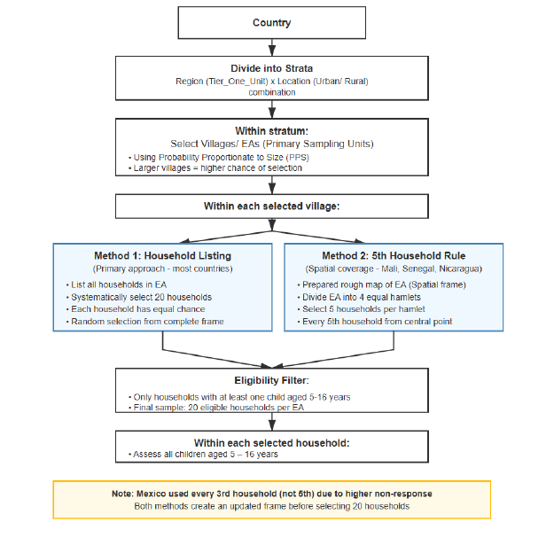
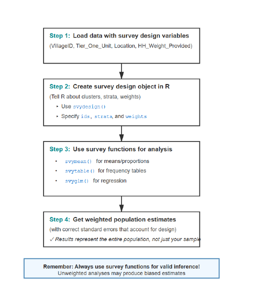

```{r, setup1, include=FALSE}
knitr::opts_chunk$set(
  warnings = FALSE,
  fig.path = 'figs/', 
  message = F
)

library(knitr)
library(cowplot) #Gives more control for figures
```

# Introduction

```{js, echo = FALSE}
title=document.getElementById('header');
title.innerHTML = '' + title.innerHTML
```


<!--chapter:end:index.Rmd-->

# Survey Design, Sampling, and Weighting

Household surveys such as PAL Network’s ICAN-ICAR study estimate population learning outcomes from a sample. The sampling design determines *which* households enter the data, and the survey design variables (weights, strata, and clusters) determine *how* analysts should estimate population quantities and uncertainty. After this chapter, you should be able to explain probability sampling, describe the ICAN-ICAR multi-stage design, interpret a survey weight, and compute design-correct estimates in R.

```{r}

#| echo: true
#| warning: false
#| message: false

library(tidyverse)
library(survey)
library(knitr)

# load the data
dat = read_csv("data/2025_PAL_ICAN-ICAR_data.csv", show_col_types = FALSE)

```

## Survey sampling and design

A census measures every household in the population. ICAN-ICAR survey data instead uses a probability sample because a census is rarely feasible at national scale. Probability sampling supports population inference because the design assigns each unit a known (or estimable) selection probability.

ICAN-ICAR survey data uses a stratified, multi-stage cluster design.@fig-pal-sampling-process illustrates the logic.

```{r}
#| label: fig-pal-sampling-process
#| echo: false
#| fig-cap: "Illustration of the ICAN-ICAR multi-stage sampling process."
#| out-width: "100%"


```

**Stage 1 (select clusters).** The survey defines primary sampling units (PSUs) such as enumeration areas, villages, or urban blocks. Within strata (for example, region-by-urban/rural categories), the design selects PSUs using probability proportional to size (PPS) so that larger PSUs have a higher chance of selection.

**Stage 2 (select households).** Within each selected PSU, the field team selects a fixed number of households using a standardized selection procedure (for example, systematic selection from a listing). This second stage produces the household sample used for data collection.

This design shapes analysis in two ways. First, learners within the same PSU tend to resemble one another, which increases uncertainty relative to a simple random sample of the same size. Second, stratification often improves precision because the sample covers key sub-populations more evenly.

## Survey weights and design-based inference

A survey weight approximates how many population units a sampled unit represents. In its simplest form, the design weight equals the inverse of the selection probability. If a household had a 1 in 500 chance of selection, its basic weight would be 500. In other words, that household represents 500 households in the population.The ICAN-ICAR survey data includes a household weight variable, `HH_Weight_Provided`, which can be used for population estimate.

To compensate for households that were selected but did not respond (or were missed), the weights are adjusted so that responding households “stand in” for similar households that did not respond. This may also involve post-stratification — adjusting weights so
that certain known totals (e.g. population by region, or by urban/rural) align with census figures. These adjustments reduce bias from non-response and any sampling frame imperfections.


Ignoring survey weights or clustering can make your analysis misrepresent both the population estimate and its uncertainty. If selection probabilities vary, unweighted summaries describe the sample rather than the population, whereas weighting targets the population by rebalancing each observation's contribution. Clustering also induces correlation within PSUs, thus treating the data as a random sample typically understates standard errors and produces confidence intervals that are too narrow. Survey-aware methods incorporates the design to estimate uncertainty correctly.

The `svydesign()` from the `survey` package represents the sampling design through a design object. After you create that object, you pass it to survey-aware estimators such as `svymean()` and `svyglm()`. In multi-country analysis, cluster and strata identifiers can repeat across countries. The safest approach is to use `interaction()` so that identifiers become unique across the pooled data.

```{r}
#| eval: false

options(
  survey.lonely.psu = "adjust",
  survey.adjust.domain.lonely = TRUE
)

des = svydesign(
  ids     = ~interaction(CountryName, VillageID) + HHID,
  strata  = ~interaction(CountryName, Tier_One_Unit),
  weights = ~HH_Weight_Provided,
  data    = dat,
  nest    = TRUE
)
```

Let's break down each component:

**1. `ids = ~interaction(CountryName, VillageID) + HHID`**

This specifies the **two-stage cluster structure**:

-   **Stage 1:** EAs/Villages (identified uniquely by `interaction(CountryName, VillageID)`)
-   **Stage 2:** Households within EAs (identified by `HHID`)

We use `interaction()` to create unique EA identifiers across countries, since the same `VillageID` might exist in multiple countries. The `+` indicates nested stages (households within EAs)

**2. `strata = ~interaction(CountryName, Tier_One_Unit)`**

Stratification variables are the geographic regions within each country. `Tier_One_Unit` represents the first-level administrative division (provinces, districts, etc.). We interact this with `CountryName` to treat each country as its own separate stratification system. This ensures that sampling variability is calculated correctly within each country's design

**3. `weights = ~HH_Weight_Provided`**

This is the final household weight variable provided in the data. Already incorporates all necessary adjustments (selection probabilities, non-response, post-stratification)

**4. `nest = TRUE`**

This is essential when cluster IDs are only unique within strata. It tells R that `VillageID` values can repeat across different strata/countries, and prevents R from treating EAs with the same ID in different countries as the same cluster.

The example below compares an unweighted and weighted estimate of the proportion of enrolled learners who meet minimum proficiency in both maths and reading in Senegal.

```{r}
#| label: compare weighted and unweighted
#| warning: false
#| message: false

# filter to enrolled learners in Senegal
one_country = dat |>
  filter(CountryName == "Senegal" & enr_status == "Currently Enrolled")

# unweighted (sample) estimate
prop_unweighted = mean(one_country$MPL_both, na.rm = TRUE)
prop_unweighted
```


```{r}

# weighted estimate with design-correct SE
options(
  survey.lonely.psu = "adjust",
  survey.adjust.domain.lonely = TRUE
)

des_one = svydesign(
  ids     = ~interaction(CountryName, VillageID) + HHID,
  strata  = ~interaction(CountryName, Tier_One_Unit),
  weights = ~HH_Weight_Provided,
  data    = one_country,
  nest    = TRUE
)


prop_weighted = svymean(~MPL_both, design = des_one, na.rm = TRUE)
prop_weighted
```

@fig-pal-analysis-workflow summarizes a practical workflow that you can reuse for descriptive statistics and modelling.

```{r}
#| label: fig-pal-analysis-workflow
#| echo: false
#| fig-cap: "A practical workflow for analysing ICAN-ICAR survey data in R."
#| out-width: "85%"


```

After you define `des`, these are the common *survey-aware* functions:

-   `svymean()` for weighted means and proportions,
-   `svytotal()` for weighted totals,
-   `svyby()` for subgroup estimates, and
-   `svyglm()` for regression models with design-correct standard errors.

## Practice exercises

1.  Change the country filter in the example and compare unweighted and weighted MPL estimates.
2.  Estimate the weighted proportion meeting MPL in maths (`MPL_math`) and compare it with the unweighted proportion.
3.  Within one country, use `svyby()` to estimate MPL by `Location` (urban/rural) for enrolled learners.

<!--chapter:end:01-survey-design-sampling-weighting.Rmd-->

# Understanding distributions

Large survey datasets contain many variables and many observations. To learn from such data, you need tools that summarise patterns clearly and accurately. This chapter introduces distributions—the way a variable’s values are spread across the sample—and shows how to describe distributions using tables, summary statistics, and simple plots. Because the ICAN-ICAR data come from a complex survey, we also show how to produce weighted summaries that reflect the target population.

```{r}
#| label: load-packages
#| echo: false
#| warning: false
#| message: false

library(tidyverse)
library(survey)
library(knitr)

# load the data
dat = read_csv("data/2025_PAL_ICAN-ICAR_data.csv")
```

## Getting oriented to the data

Firstly, check the number of rows and columns to get a sense of how big the data.

```{r}
#| label: quick-checks
#| warning: false
#| message: false

dim(dat)       # rows and columns
```

This is quite big. A good idea from here is to subset to the variables that we want to explore. The `dplyr` package has a `select` function that allows one to select and rearrange variables. For this session, we focus only on the child's age, parent's age, gender, enrollment status, and whether or not the child has met the minimum proficiency level for both numeracy and literacy.

```{r}
#| label: select-key-variables
#| warning: false
#| message: false

dat = dat |>
  select(CountryName, Location, HHID, ChildID,
         ch02, ch03, ch06a, ch06b, enr_status, pt02b,
         pt01b, ch04a, MPL_both) 

```

One can use the `skim()` function from `skimr` package to attain a broad view of the data and get useful summary statistics on each variable. It is useful because it handles data of all types and it is an alternative to `summary()`.

```{r}
library(skimr)

dat |> 
  skim()

```

*complete_rate* tells us the proportion of rows that are not missing for that particular variable. For instance, `pt02b` has only $55,4\%$ of rows that have entries. In other words, this is equivalent to $39813$ missings (see also, *n_missing)* out of the $89141$ rows. It is important to see that if one does not specify correctly the variable type, then `skim()` will not pick that up. The child's gender, `ch03`, is being recognized as a continuous variable instead of a categorical variable. Therefore, one should make sure that the variables are in their correct type to ensure correct variable summaries .

## Levels of measurement

Any variable is composed of two or more categories or attributes. Thus the child's gender is a variable with the categories male and female, country of birth is a variable with the categories being particular countries. The level of measurement of variables refers to how the categories of the variable relate to one another. There are three main levels of measurement: continuous, ordinal and categorical. Three characteristics of the categories of a variable determine its level of measurement:

1.  whether there are different categories;
2.  whether the categories can be rank ordered;
3.  whether the differences or intervals between each category can be specified in a meaningful numerical sense.

## Continuous level

A continuous variable is one in which the categories can be ranked from low to high in some meaningful way. In addition to ordering the categories from low to high it is possible to specify the amount of difference between the categories or values. The child's age, when measured in years, is an example of a continuous variable. We rank-order the categories of age (in years) from youngest (lowest) to oldest (highest). Furthermore, we can specify the amount of difference between the categories. The difference between the category "9 years old" and the category "13 years old" is 4 years. Other examples would be the number of household members, time taken to complete the numeracy assessment, and the numeracy score of the child.

We use the 5 number summary (box plot can also suffice) and a histogram to describe the distribution of continuous variables. In our data, we only have the parent's age and child's age as continuous variables.

```{r}
#| label: continuous-summaries
#| warning: false
#| message: false

# 5 number summary 
dat |> 
  select(ch02, pt02b, pt01b) |>
  skim()
```

The typical age in years the children belong is $10$ years old, while it is $36$ and $43$ years old for the mother and father respectively. The child's age is spread fairly evenly across the age categories relative to both the mother and father's ages (see the standard deviation). If one had to order the children by age from the youngest ($5$) to the oldest ($16$), then the middle child would be $10$ years old.

Now, let us assess whether the categories of each variable tend to cluster towards the low or the high end. And possibly identify the potential outliers.

```{r}
#| label: fig-age-hist
#| fig-cap: "Distribution of child age in the ICAN-ICAR sample."
#| fig-width: 6
#| fig-height: 3.5
#| warning: false
#| message: false

# Histograms and box plot 
## child's age
ggplot(dat, aes(x = ch02)) +
  geom_histogram(
    bins = 20,
    aes(y = after_stat(count / sum(count) * 100)),
    fill = "gold"
  ) +
  labs(x = "Age (years)", y = "Percentage (%)",
       title = "Child's age histogram with percentage") +
  theme_bw()

## father's age 
ggplot(dat, aes(x = pt02b)) +
  geom_histogram(
    bins = 20,
    aes(y = after_stat(count / sum(count) * 100)),
    fill = "skyblue"
  ) +
  labs(x = "Age (years)", y = "Percentage (%)",
       title = "Father's age histogram with percentage") +
  theme_bw()

## mother's age
ggplot(dat, aes(x = pt01b)) +
  geom_histogram(
    bins = 20,
    aes(y = after_stat(count / sum(count) * 100)),
    fill = "magenta"
  ) +
  labs(x = "Age (years)", y = "Percentage (%)",
       title = "Mother's age histogram with percentage") +
  theme_bw()

```

For the child's age there is no evidence clustering - the variable is spread fairly evenly across the categories. Both the mother's and father's age cluster at the lower end of their respective distributions, with tails on the high end.

## Ordinal level

An ordinal variable is one where we can rank-order categories from low to high. However, we cannot specify in numeric terms how much difference there is between the categories. For example, when the age variable has categories such as "child", "adolescent", "young adult", "middle aged" and "elderly" the variable is measured at the ordinal level. The categories can be ordered from youngest to eldest but we cannot specify precisely the age gap between people in different categories. Measuring the child's difficulty in their eyesight as "no difficulty", "some difficulty", and "a lot of difficulty" would produce an ordinal variable.

Typically, one can describe the distribution of an ordinal variable by asking about the frequency of children belonging to particular categories, asking which categories have a lot of cases and which have fewer cases. In that a frequency table will suffice.

Since the categories of ordinal variables can be ranked these categories should be put in their correct rank order in a frequency table. Failure to do so will distort both patterns in the data and statistics used to summarise them. 

```{r}
#| label: eyesight-freq-tables
#| warning: false
#| message: false

# first insert appropriate labels 
dat = dat |>
        mutate(
          ch04a = as.character(ch04a), 
          ch04a = case_when(
            ch04a == "1" ~ "No difficulty", 
            ch04a == "2" ~ "Some difficulty", 
            ch04a == "3" ~ "A lot of difficulty", 
            ch04a == "4" ~ "Cannot do at all", 
            TRUE ~ ch04a
          )
        )

# convert to ordered factor 
dat = dat |>
       mutate(
         ch04a = factor(ch04a, levels = c("No difficulty", 
                                          "Some difficulty", 
                                          "A lot of difficulty", 
                                          "Cannot do at all"), 
                                 ordered = TRUE)
       )


```

Now, we are set to create a frequency table for the eyesight variable.

```{r}

dat |>
  count(ch04a) |>
  mutate(
    percent = 100*(n/sum(n))
  )
```

Pay attention to the description of `ch04a` - R recognizes it as an \<ord\> now. From the table, we can see that only $2,9\%$ children in the sample have some form of difficulty in their eyesight, even after wearing glasses. One category in this variable accounts for the bulk of the cases. One can say that this sample is fairly homogeneous with regards to `ch04a` . In other words, the frequency table is not symmetrical because most of the cases are clustered at one end of a distribution of this ordinal variable. When cases are clustered at the low end the distribution is positively skewed.

Sometimes ordinal variables can often be displayed effectively with graphs. Now, we can going to show how `ch04a` is distributed using a bar graph.

```{r}
#| label: bar-graph-eyesight

dat |>
  ggplot(aes(x = ch04a))+
  geom_bar(fill = "violet")+
  theme_bw() +
  labs(title = "Vertical bar chart with counts", 
           x = "Eyesight")

```
While the mode as a measure of central tendency can be for ordinal variables the median is preferred because it takes account of the fact that children can be ranked on ordinal variables. The median is worked out by ranking each case in a distribution from low to high on the variable and finding the middle child. Whatever the category the middle child belongs to is the median category. In large scale survey research, this is done by obtaining a frequency table, as we have done above, for the variable and examining the cumulative percentage column. To locate the median simply look down this column until the cumulative percentage nudges over $50$ percent and then look at the category of the variable that corresponds to this. In `ch04a` case, the middle child is the one with no difficulty in eyesight.

## Categorical level 
A categorical variable is one where the different categories have no set rank-order. With a categorical variable it makes no sense to say that the categories can be ordered from low to high in some sense. The type of school the child goes to (`ch06b`) is a categorical variable where categories have no natural rank-order. 

Two main types of summarising statistics are used for categorical variables to describe their distributions: those used to indicate typical values (central tendency), and those used to indicate group variation With categorical variables the only way to indicate the typical response is to identify the single most common response. The most common response, the one with the largest number of cases, is called the mode. 

```{r}

# firstly, give proper labels 
dat = dat |>
        mutate(
          ch06b = as.character(ch06b), 
          ch06b = case_when(
            ch06b == "1" ~ "Government", 
            ch06b == "2" ~ "Private", 
            ch06b == "3" ~ "Other", 
            TRUE ~ ch06b
          )
        )
# create a frequency table
dat |> 
  count(ch06b) |>
  mutate(percent = 100*(n/sum(n)))
```
In the table above, the single most common response is "Government", thus "Government" schools is the mode of the `ch04a`. But, sometimes using the mode to measure the typical response is problematic. Picking the most common response does not tell us how typical it is. In that case, we have to provide a way of summarising how diverse a group is. For categorical variables the appropriate measure of variation is the variation ratio. It is easily calculated by seeing what percentage of children are not in the model category. The variation ratio is normally expressed as a proportion. This is simply done by moving the decimal place on the percentage figure (percent not in modal category) two places to the left. Thus in the frequency table, the mode is "Government" which contains $66,2\%$ of the sample. The percentage not in the model category is therefore $33.8\%$. The variation ratio therefore is $0,33$. 

It is desirable to use a measure of variation alongside a measure of central tendency. The measure of central tendency gives us an idea of what is typical while the measure of variation gives us a sense og how typical typical is. The more variation there is in a sample the less well the average summarises the sample. In the case of the variation ratio - the higher the variation ratio the more poorly the mode summarises the overall distribution of the categorical variable. 

A bar chart is most appropriate graphical tool one can use to describe the distribution of a categorical variable. 

```{r}
#| label: bar-graph-schooltype

dat |>
  ggplot(aes(x = ch06b))+
  geom_bar(
    aes(y = after_stat(count / sum(count) * 100)),
    fill = "violet"
    ) +
  coord_flip() +
  theme_bw() +
  labs(title = "Horizontal bar chart with counts", 
            y= "School Type")

```
The table below summarises the graphical representation that can be used to describe variables at each of the three levels of measurement. Consider these everytime.
```{r echo=FALSE}


library(knitr)
library(kableExtra)
table13 <- data.frame(
  `Graph type` = c("Bar charts", "Line graphs", "Area graph", "Histogram", "Boxplot", "Pie chart"),
  Nominal  = c("✓", "✗", "✗", "✗", "✗", "✓"),
  Ordinal  = c("✓", "?", "?", "✗", "✓", "✓"),
  Interval = c("?", "✓", "✓", "✓", "✓", "?"),
  check.names = FALSE
)

kable(
  table13,
  caption = "Graph type by level of measurement",
  align = c("l", "c", "c", "c"), 
  booktabs= TRUE
)  %>%
  kable_styling(full_width = FALSE, position = "center")
```

Also, the table below helps one to choose summary descriptive statistics for different levels of measurement

```{r}
library(knitr)
library(kableExtra)

table_data <- data.frame(
  Category = c(
    "Averages","",
    "",
    "Dispersion/variation","",
    "",
    "Symmetry","",
    "Kurtosis",""
  ),
  Statistic = c(
    "Mode","Median","Mean",
    "Variation ratio","Interquartile range","Variance/standard deviation",
    "Graph/visual","Skewness statistic",
    "Graph/visual","Kurtosis statistic"
  ),
  Nominal = c("✓","✗","✗","✓","✗","✗","✗","✗","✗","✗"),
  Ordinal = c("?","✓","✗","?","✓","✗","✓","✗","✓","✗"),
  Interval = c("?","?","✓","?","?","✓","✓","✓","✓","✓")
)

kable(
  table_data,
  caption = "Choosing summary descriptive statistics for different levels of measurement",
  align = "c",
  booktabs = TRUE
) %>%
  kable_styling(full_width = FALSE, position = "center")
```


## Weighted summaries using the survey design

Unweighted summaries describe the sample. To describe the population, you must account for weights, clustering, and stratification.

We create a survey design object using the same structure used elsewhere in the course.

```{r}
#| label: create-survey-design
#| warning: false
#| message: false

options(
  survey.lonely.psu = "adjust",
  survey.adjust.domain.lonely = TRUE
)

des_child_all = svydesign(
  ids     = ~interaction(CountryName, VillageID) + HHID,
  strata  = ~interaction(CountryName, Tier_One_Unit),
  weights = ~HH_Weight_Provided,
  data    = dat,
  nest    = TRUE
)
```

### Weighted proportions and means

A weighted proportion of girls in the population:

```{r}
#| label: weighted-prop-girls
#| warning: false
#| message: false

svymean(~I(ch03 == 1), des_child_all, na.rm = TRUE)
```

Weighted means for several continuous variables:

```{r}
#| label: weighted-means
#| warning: false
#| message: false

svymean(~ch02 + pt02b + pt01b, des_child_all, na.rm = TRUE)
```

### Weighted frequency tables

Weighted distributions use `svytable()`.

```{r}
#| label: weighted-country-table
#| warning: false
#| message: false

country_w = svytable(~CountryName, des_child_all)

country_w_tbl = tibble(
  CountryName = names(country_w),
  weighted_n  = as.numeric(country_w),
  percent     = as.numeric(100 * prop.table(country_w))
)
```

## Household-level variables in a child-level file

When a household-level variable repeats across children, a child-level frequency table over-weights large households. A simple fix is to keep one record per household.

```{r}
#| label: hh-first-flag
#| warning: false
#| message: false

dat = dat |>
  arrange(HHID, ChildID) |>
  group_by(HHID) |>
  mutate(hh_first = row_number() == 1) |>
  ungroup()
```

For example, compare a child-level and household-level distribution of roof type (`hh07a`), if that variable is available in your extract.

```{r}
#| label: roof-child-vs-household
#| eval: false

# child-level distribution (counts children)
dat |>
  count(hh07a) |>
  mutate(percent = 100 * n / sum(n))

# household-level distribution (counts households once)
dat |>
  filter(hh_first) |>
  count(hh07a) |>
  mutate(percent = 100 * n / sum(n))
```

To produce a weighted household-level distribution, subset the survey design to one row per household.

```{r}
#| label: weighted-household-roof
#| eval: false

options(
  survey.lonely.psu = "adjust",
  survey.adjust.domain.lonely = TRUE
)

des_child_all = svydesign(
  ids     = ~interaction(CountryName, VillageID) + HHID,
  strata  = ~interaction(CountryName, Tier_One_Unit),
  weights = ~HH_Weight_Provided,
  data    = dat,
  nest    = TRUE
)

des_household = subset(des_child_all, hh_first)

roof_w = svytable(~hh07a, des_household)

tibble(
  roof_type = names(roof_w),
  percent   = as.numeric(100 * prop.table(roof_w))
)
```

## Missing data and skip patterns

Missing values are common in survey data. In ICAN-ICAR, missingness often reflects skip patterns. For example, grade (`ch06a`) is usually recorded only for learners who are currently enrolled.

Start by checking how much is missing.

```{r}
#| label: missing-grade
#| warning: false
#| message: false

dat |>
  summarise(
    total = n(),
    missing_ch06a = sum(is.na(ch06a)),
    missing_pct = 100 * sum(is.na(ch06a)) / n()
  )
```

Then evaluate whether missingness aligns with enrolment status.

```{r}
#| label: missing-by-enrolment
#| warning: false
#| message: false

dat |>
  group_by(enr_status) |>
  summarise(
    total = n(),
    missing_ch06a = sum(is.na(ch06a)),
    missing_pct = 100 * sum(is.na(ch06a)) / n()
  ) |>
  arrange(desc(total))
```

You can also estimate weighted missingness rates by subgroup.

```{r}
#| label: weighted-missingness-by-enrolment
#| warning: false
#| message: false

svyby(
  ~I(is.na(ch06a)),
  ~enr_status,
  des_child_all,
  svymean,
  na.rm = TRUE
)
```

## Exercises

Use the ICAN-ICAR data and the tools in this chapter to answer the questions below.

1.  What proportion of the sample is rural (`Location == "Rural"`)? Compute both the unweighted and weighted estimate.
2.  What is the unweighted and weighted mean child age (`ch02`) for enrolled learners (`enr_status == "Currently Enrolled"`)?
3.  Create an age group variable (for example, `<= 10` vs `> 10`). What share of learners falls in each age group?
4.  Produce a weighted frequency table for `Location` within one country of your choice.
5.  Investigate missingness in `ch06a` by `residence` and by `sex`. Report the results as unweighted and weighted proportions.

<!--chapter:end:02-understanding-distributions.Rmd-->

# Central Tendency and Dispersion

Descriptive statistics summarise data in ways that support interpretation and comparison. In household surveys such as PAL Network’s ICAN-ICAR study, you should compute these summaries with survey weights and design variables when your goal is population inference.

After this chapter, you should be able to (i) compute and interpret measures of central tendency (mean, median, and mode), (ii) compute and interpret measures of dispersion (variance, standard deviation, and interquartile range), and (iii) produce weighted, design-correct summaries in R.

```{r}
#| label: setup-central-tendency
#| echo: false
#| warning: false
#| message: false

# Load packages 
library(tidyverse)
library(survey)
library(knitr)

# load the data
dat = read_csv("data/2025_PAL_ICAN-ICAR_data.csv", show_col_types = FALSE)

# keep observations with valid weights (so weighted and unweighted use the same sample)
dat = dat |>
  filter(!is.na(HH_Weight_Provided))

# create simple labels used in examples
dat = dat |>
  mutate(
    sex = factor(ch03, levels = c(1, 2), labels = c("Female", "Male")),
    residence = Location |> str_trim() |> factor(levels = c("Rural", "Urban"))
  )

# survey design object (consistent with the logistic regression chapter)
options(
  survey.lonely.psu = "adjust",
  survey.adjust.domain.lonely = TRUE
)

des = svydesign(
  ids     = ~interaction(CountryName, VillageID) + HHID,
  strata  = ~interaction(CountryName, Tier_One_Unit),
  weights = ~HH_Weight_Provided,
  nest    = TRUE,
  data    = dat
)
```

## Central tendency

Measures of central tendency describe a “typical” value.

**Mean.** The mean is the arithmetic average. It uses all observations and is sensitive to extreme values.

**Median.** The median is the 50th percentile. It remains stable when a small number of observations are very large or very small, so it is often more informative for skewed distributions.

**Mode.** The mode is the most common value. It is most useful for categorical variables.

The next example uses ICAR assessment time as a continuous variable. If your dataset stores this variable under a different name (for example, `ican_assess_time`), replace it in the code.

```{r}
#| label: summary-assessment-time
#| message: false
#| warning: false

summary(dat$icar_assess_time)

tibble(
  statistic = c("mean", "median"),
  value = c(
    mean(dat$icar_assess_time, na.rm = TRUE),
    median(dat$icar_assess_time, na.rm = TRUE)
  )
) 
```

A distribution plot helps you interpret the difference between the mean and the median. When the distribution is right-skewed, a small number of large values typically pulls the mean above the median.

```{r}
#| label: fig-hist-assessment-time
#| echo: false
#| warning: false
#| message: false
#| fig-cap: "Histogram of ICAR assessment time."
#| fig-height: 3.6

dat |>
  filter(!is.na(icar_assess_time)) |>
  ggplot(aes(x = icar_assess_time)) +
  geom_histogram(binwidth = 20, fill = "magenta") +
  labs(x = "ICAR assessment time", y = "Count") + 
  theme_bw()
```

To compute a mode for a categorical variable, count frequencies and select the largest count.

```{r}
#| label: mode-example
#| message: false
#| warning: false

dat |>
  filter(!is.na(residence)) |>
  count(residence, name = "n") |>
  arrange(desc(n)) |>
  slice(1) 
```

## Dispersion

Measures of dispersion describe how much values vary.

**Variance and standard deviation.** The variance is the average squared deviation from the mean. The standard deviation is the square root of the variance, so it is measured on the original scale.

**Interquartile range (IQR).** The IQR is the distance between the 75th and 25th percentiles. It summarises spread in the middle of the distribution and is less sensitive to outliers than the standard deviation.

```{r}
#| label: dispersion-unweighted
#| message: false
#| warning: false

tibble(
  statistic = c("sd", "IQR"),
  value = c(
    sd(dat$icar_assess_time, na.rm = TRUE),
    IQR(dat$icar_assess_time, na.rm = TRUE)
  )
)
```

## Weighted, design-correct summaries

Unweighted summaries describe the sample. Weighted, design-correct summaries target the population and use appropriate standard errors for a stratified, clustered design.

The code below estimates the population mean of ICAR assessment time for one country using the survey design object. It also computes the median through a weighted quantile.

```{r}
#| label: weighted-mean-and-median
#| message: false
#| warning: false

des_country = subset(des, CountryName == "Senegal" & !is.na(icar_assess_time))

m = svymean(~icar_assess_time, design = des_country, na.rm = TRUE)
q50 = svyquantile(~icar_assess_time, design = des_country, quantiles = 0.5, na.rm = TRUE)

tibble(
  quantity = c("mean (weighted)", "median (weighted)"),
  estimate = c(coef(m)[["icar_assess_time"]], coef(q50))
)

```

To compare groups, use `svyby()` so that estimates and standard errors respect the design.

```{r}
#| label: weighted-by-sex
#| eval: false

svyby(
  ~icar_assess_time,
  ~sex,
  design = subset(des, CountryName == "Senegal" & !is.na(icar_assess_time) & !is.na(sex)),
  FUN = svymean,
  na.rm = TRUE
)
```

## Outliers and the unit of analysis

In PAL data, some variables are defined at the household level (for example, household size). When the dataset includes multiple children per household, household-level quantities appear repeatedly. A household summary should therefore use one row per household.

The code below constructs a household-level dataset by keeping the first observation in each household. It then shows how an outlier can affect the mean more than the median.

```{r}
#| label: household-size-example
#| message: false
#| warning: false

dat_hh = dat |>
  group_by(HHID) |>
  slice(1) |>
  ungroup() |>
  mutate(
    hh_size = ifelse(hh06a > 0 & hh06a <= 50, hh06a, NA_real_)  # simple, transparent cutoff
  )

tibble(
  statistic = c("mean", "median"),
  value = c(
    mean(dat_hh$hh_size, na.rm = TRUE),
    median(dat_hh$hh_size, na.rm = TRUE)
  )
)
```

If a small number of extreme values drives the mean away from the typical household size, the median or the IQR usually provides a clearer summary of the distribution.

## Practice exercises

1. For a country of your choice, compute the unweighted mean and median of `icar_assess_time`. Then compute the weighted mean and weighted median using `svymean()` and `svyquantile()`.
2. Use `svyby()` to estimate the weighted mean ICAR assessment time by `residence` for one country. Interpret the difference.
3. For household size (`hh06a`), compare the mean and median using the household-level dataset created in this chapter. Explain which measure better represents a “typical” household size and why.
4. Choose one additional continuous variable (for example, child age `ch02`). Compute its mean, median, standard deviation, and IQR, and then describe the distribution in two to three sentences.

<!--chapter:end:03-central-tendency-dispersion.Rmd-->

# Bivariate Analysis

Bivariate analysis examines the relationship between two variables. In PAL ICAN-ICAR survey work, it helps you describe differences across groups (for example, enrolment by residence) and patterns between numeric measures (for example, numeracy score by age). This chapter focuses on descriptive bivariate tools—cross-tabulations, group summaries, and scatterplots—while emphasising survey weights and clustering for population inference.

```{r}
#| label: setup-bivariate
#| echo: false
#| warning: false
#| message: false

library(tidyverse)
library(survey)
library(knitr)

# load PAL data
dat = read_csv("data/2025_PAL_ICAN-ICAR_data.csv", show_col_types = FALSE)

# keep rows with valid weights so unweighted and weighted results use the same analytic sample
dat = dat |>
  filter(!is.na(HH_Weight_Provided))

# recode common variables used in examples
dat = dat |>
  mutate(
    sex = factor(ch03, levels = c(1, 2), labels = c("Female", "Male")),
    residence = str_trim(Location) |> factor(levels = c("Rural", "Urban")),
    enrolled = factor(
      case_when(
        ch05 == 1 ~ "Enrolled",
        ch05 == 0 ~ "Not enrolled",
        TRUE ~ NA_character_
      ),
      levels = c("Enrolled", "Not enrolled")
    ),
    age = if_else(ch02 > 0, ch02, NA_real_)
  )

# create numeracy_score if it is not already present
if (!("numeracy_score" %in% names(dat))) {
  numeracy_items = paste0("n", 1:36)
  if (all(numeracy_items %in% names(dat))) {
    dat = dat |>
      mutate(
        across(
          all_of(numeracy_items),
          ~ case_when(
            .x == 2 ~ 1,
            .x %in% c(0, 1) ~ 0,
            TRUE ~ NA_real_
          )
        ),
        numeracy_score = rowSums(across(all_of(numeracy_items)), na.rm = TRUE)
      )
  } else {
    dat$numeracy_score = NA_real_
  }
}

# create literacy_score if it is not already present
if (!("literacy_score" %in% names(dat))) {
  literacy_items = c(
    paste0("l1.", 1:4),
    paste0("l2.", 1:5),
    paste0("l3.", 1:5),
    paste0("l4.", 1:6),
    paste0("l5.", 1:5),
    paste0("l6.", 1:5)
  )
  if (all(literacy_items %in% names(dat))) {
    dat = dat |>
      mutate(
        across(
          all_of(literacy_items),
          ~ case_when(
            .x == 2 ~ 1,
            .x %in% c(0, 1) ~ 0,
            TRUE ~ NA_real_
          )
        ),
        literacy_score = rowSums(across(all_of(literacy_items)), na.rm = TRUE)
      )
  } else {
    dat$literacy_score = NA_real_
  }
}

# grouped versions (useful for cross-tabs)
dat = dat |>
  mutate(
    numeracy_group = case_when(
      is.na(numeracy_score) ~ NA_character_,
      numeracy_score <= 12 ~ "Low",
      numeracy_score <= 24 ~ "Medium",
      numeracy_score > 24  ~ "High"
    ) |> factor(levels = c("Low", "Medium", "High")),
    literacy_group = case_when(
      is.na(literacy_score) ~ NA_character_,
      literacy_score <= 10 ~ "Low",
      literacy_score <= 20 ~ "Medium",
      literacy_score > 20  ~ "High"
    ) |> factor(levels = c("Low", "Medium", "High"))
  )

# survey design object (multi-country file: make strata and PSU ids unique by country)
options(
  survey.lonely.psu = "adjust",
  survey.adjust.domain.lonely = TRUE
)

des = svydesign(
  ids     = ~interaction(CountryName, VillageID) + HHID,
  strata  = ~interaction(CountryName, Tier_One_Unit),
  weights = ~HH_Weight_Provided,
  data    = dat,
  nest    = TRUE
)
```

## Choosing the right bivariate tool

Select a method based on the measurement type of each variable.

- **Categorical × categorical:** use a cross-tabulation and report row or column proportions.
- **Continuous × categorical:** compare group summaries (means, medians, and spread).
- **Continuous × continuous:** use a scatterplot and summarise the trend.

When you want population statements, use weighted estimators and design-correct standard errors.

## Categorical × categorical: cross-tabulations

A cross-tabulation shows how the categories of one variable distribute across the categories of another. Use **column proportions** to compare rates across groups and **row proportions** to describe composition within a category.

The example below describes enrolment by sex.

```{r}
#| label: crosstab-unweighted
#| warning: false

tab_enroll_sex = table(dat$enrolled, dat$sex, useNA = "no")

tab_enroll_sex
prop.table(tab_enroll_sex, margin = 2)   # column proportions: enrolment rate by sex
```

The same analysis becomes a population estimate when you use the survey design object.

```{r}
#| label: crosstab-weighted
#| warning: false

tab_enroll_sex_w = svytable(~enrolled + sex, design = subset(des, !is.na(enrolled) & !is.na(sex)))

tab_enroll_sex_w
prop.table(tab_enroll_sex_w, margin = 2)
```

**Interpretation rule.** If your question is “What proportion of girls are enrolled?”, read the *Enrolled* cell within the *Female* column of the column-proportion table.

## Continuous × categorical: comparing group means

When one variable is numeric and the other defines groups, start with group summaries. Report the mean and a measure of dispersion (such as the standard deviation). Use weighted means for population-level comparisons.

The example below compares mean numeracy score by enrolment status.

```{r}
#| label: mean-by-group-unweighted
#| warning: false

dat |>
  filter(!is.na(enrolled) & !is.na(numeracy_score)) |>
  group_by(enrolled) |>
  summarise(
    mean_score = mean(numeracy_score, na.rm = TRUE),
    sd_score   = sd(numeracy_score, na.rm = TRUE),
    n          = n(),
    .groups = "drop"
  ) 
```

Weighted means (with design-correct standard errors) use `svyby()` and `svymean()`.

```{r}
#| label: mean-by-group-weighted
#| warning: false

svyby(
  ~numeracy_score, ~enrolled,
  design = subset(des, !is.na(enrolled) & !is.na(numeracy_score)),
  svymean,
  na.rm = TRUE
)
```

## Continuous × continuous: scatterplots and trends

A scatterplot summarizes how two numeric variables move together. Use it to detect patterns, outliers, and heterogeneity.

The plot below shows numeracy score by age. It is descriptive; later chapters formalise such relationships with regression.

```{r}
#| label: fig-scatter-age-numeracy
#| fig-cap: "Scatterplot of numeracy score by child age (sample description)."
#| warning: false
#| message: false

dat |>
  filter(!is.na(age) & !is.na(numeracy_score)) |>
  ggplot(aes(x = age, y = numeracy_score)) +
  geom_point(alpha = 0.2) +
  stat_smooth(method = "lm", se = FALSE) +
  labs(x = "Child age (years)", y = "Numeracy score") +
  theme_bw()
```

If you want a design-correct summary of the average relationship, you can fit a survey-weighted linear model.

```{r}
#| label: svyglm-age-numeracy
#| warning: false

fit_age = svyglm(
  numeracy_score ~ age,
  design = subset(des, !is.na(age) & !is.na(numeracy_score))
)

summary(fit_age)
```

## Testing association with chi-squared tests

A chi-squared test evaluates whether two categorical variables are statistically independent.

First, compute the test for the sample (unweighted).

```{r}
#| label: chisq-unweighted
#| warning: false

tab_enroll_res = table(dat$enrolled, dat$residence, useNA = "no")
chisq.test(tab_enroll_res)
```

For population inference under a complex survey design, use the design-based chi-squared test.

```{r}
#| label: chisq-weighted
#| warning: false

svychisq(
  ~enrolled + residence,
  design = subset(des, !is.na(enrolled) & !is.na(residence))
)
```

## Practice exercises

1. Estimate the proportion of non-enrolled children in rural and urban areas. Report the result as a population estimate using `svytable()` and column proportions.
2. Compare mean ICAR assessment time (`icar_assess_time`) by residence. Report unweighted and weighted means.
3. Cross-tabulate `numeracy_group` by `literacy_group`. Describe the pattern using column proportions.
4. Test whether enrolment status differs by residence using `chisq.test()` and `svychisq()`. State which test supports population inference and why.
5. Create a scatterplot of `icar_assess_time` against `numeracy_score`. Describe the direction and variability of the relationship in one paragraph.

<!--chapter:end:04-bivariate-analysis.Rmd-->

# Simple Linear Regression

Regression analysis describes how an outcome changes as a predictor changes. In this chapter, you will learn how to summarise the association between two numeric variables with a correlation coefficient and how to estimate a simple linear regression model. Because ICAN-ICAR uses a complex survey design, you will also fit the same model with survey weights, clustering, and stratification so that inference reflects the sampling design.

```{r}
#| echo: false
#| warning: false
#| message: false

library(tidyverse)
library(broom)
library(survey)
library(knitr)

# load the data
dat = read_csv("data/2025_PAL_ICAN-ICAR_data.csv", show_col_types = FALSE)
```

## Preparing variables for analysis

We study the relationship between a child’s grade (`ch06a`) and a literacy score constructed from item-level responses. Grade is a plausible predictor because it often reflects additional exposure to schooling. Regression can quantify association, but it does not by itself establish causality; use theory and study design to justify causal claims.

**Literacy score.** The literacy items are coded so that `2` indicates a correct response and `0` or `1` indicates an incorrect response. We recode correct responses to `1`, recode incorrect responses to `0`, and sum across items. This scoring treats missing item responses as incorrect when it computes totals (`na.rm = TRUE`). Use a different rule if your assessment protocol defines missingness differently.

```{r}
#| label: create literacy score
#| warning: false
#| message: false

# keep observations with non-missing weights (so weighted and unweighted use the same cases)
dat = dat |> 
  filter(!is.na(HH_Weight_Provided))

# grade (keep plausible values; adjust bounds if your instrument differs)
dat = dat |>
  mutate(
    grade = ifelse(ch06a >= 0 & ch06a <= 12, ch06a, NA_real_)
  )

# literacy items (update these names if your dataset differs)
literacy_items = c(
  paste0("l1.", 1:4),
  paste0("l2.", 1:5),
  paste0("l3.", 1:5),
  paste0("l4.", 1:6),
  paste0("l5.", 1:5),
  paste0("l6.", 1:5)
)

dat = dat |>
  mutate(
    across(
      all_of(literacy_items),
      ~ case_when(
        .x == 2 ~ 1,
        .x %in% c(0, 1) ~ 0,
        TRUE ~ NA_real_
      )
    ),
    literacy_score = rowSums(across(all_of(literacy_items)), na.rm = TRUE)
  )
```

For the examples below, we work with one country to keep output readable. Replace the value of `country_name` to analyse a different country.

```{r}
#| label: analysis sample
#| warning: false
#| message: false

country_name = "Senegal"

d = dat |>
  filter(
    CountryName == country_name,
    !is.na(grade),
    !is.na(literacy_score)
  )
```

## Correlation and simple regression

Correlation provides a first summary of a linear relationship between two numeric variables. A correlation near `0` indicates a weak linear association, while values close to `1` or `-1` indicate a strong positive or negative linear association. Because correlation targets linear patterns, treat it as a starting point rather than a complete description.

```{r}
#| label: unweighted correlation
#| warning: false
#| message: false

cor_unweighted = cor(d$grade, d$literacy_score, use = "complete.obs")
cor_unweighted
```

**A quick check.** A scatterplot helps you assess whether a linear relationship is plausible and whether a small number of extreme values dominate the pattern.

```{r}
#| label: scatterplot
#| warning: false
#| message: false

ggplot(d, aes(x = grade, y = literacy_score)) +
  geom_point(alpha = 0.35) +
  geom_smooth(method = "lm", se = FALSE) +
  labs(
    x = "Grade",
    y = "Literacy score",
    title = paste("Literacy score and grade in", country_name)
  ) +
  theme_classic()
```

A simple linear regression model has the form

\[
Y_i = \alpha + \beta X_i + \varepsilon_i,
\]


where \(\beta\) (the slope) describes the expected change in \(Y\) for a one-unit increase in \(X\). In our example,

\[
\text{literacy\_score}_i = \alpha + \beta \cdot \text{grade}_i + \varepsilon_i.
\]

The unweighted model describes the relationship in the sample.

```{r}
#| label: lm unweighted
#| warning: false
#| message: false

m_lm = lm(literacy_score ~ grade, data = d)

tidy(m_lm, conf.int = TRUE) 

```

## Survey-weighted regression for population inference

To make population statements, fit the regression with the survey design. This approach accounts for weights, clustering, and stratification when it computes standard errors.

```{r}
#| label: survey design object
#| warning: false
#| message: false

options(
  survey.lonely.psu = "adjust",
  survey.adjust.domain.lonely = TRUE
)

des = svydesign(
  ids     = ~interaction(CountryName, VillageID) + HHID,
  strata  = ~interaction(CountryName, Tier_One_Unit),
  weights = ~HH_Weight_Provided,
  data    = dat,
  nest    = TRUE
)

des_country = subset(des, CountryName == country_name & !is.na(grade) & !is.na(literacy_score))
```

```{r}
#| label: weighted correlation
#| warning: false
#| message: false

V = svyvar(~grade + literacy_score, design = des_country, na.rm = TRUE)

cor_weighted = V[1, 2] / sqrt(V[1, 1] * V[2, 2])
cor_weighted
```

```{r}
#| label: svyglm weighted
#| warning: false
#| message: false

m_svy = svyglm(literacy_score ~ grade, design = des_country)

tidy(m_svy, conf.int = TRUE) 
```

Interpret the slope as the expected change in the literacy score associated with a one-grade increase, holding the model form fixed. Use the survey-based standard errors and confidence intervals for inference.

**Predicted values.** Predictions translate the fitted line into an expected score at a specific grade. The example below reports the predicted literacy score for grade 3, with a standard error from the survey model.

```{r}
#| label: prediction grade 3
#| warning: false
#| message: false

new = tibble(grade = 3)

pred = predict(m_svy, newdata = new, se.fit = TRUE)
pred

```

## Practice exercises

1. Replace `country_name` with a different country and compare the weighted and unweighted correlations.
2. Fit the survey-weighted model for one country and interpret the slope in a single sentence.
3. Change the prediction grade from 3 to 6. How does the predicted score change?
4. Repeat the analysis using `ch02` (age) as the predictor instead of grade. Compare the interpretation with the grade model.

<!--chapter:end:05-simple-linear-regression.Rmd-->

# Multiple Linear Regression

Simple linear regression relates an outcome to one predictor. Multiple linear regression extends the same idea by including several predictors in one model. Researchers use this approach to estimate *partial associations*: each coefficient describes the association between a predictor and the outcome **holding the other predictors constant**.

In this chapter, we use PAL Network’s ICAN-ICAR 2025 survey data to model a continuous outcome (for example, a numeracy score) as a function of grade, age, and background characteristics. Because ICAN-ICAR uses stratification, clustering, and survey weights, we fit models with the `survey` package so that standard errors reflect the sampling design.

```{r}
#| label: setup-multiple-regression
#| echo: false
#| warning: false
#| message: false

library(tidyverse)
library(survey)
library(broom)
library(knitr)

dat <- read_csv("data/2025_PAL_ICAN-ICAR_data.csv", show_col_types = FALSE)

# Keep only cases with provided household weights
dat = dat |>
  filter(!is.na(HH_Weight_Provided)) |>
  mutate(
    ch02_num = as.numeric(ch02),
    ch06a_num = as.numeric(ch06a),
    ican_time_raw = as.numeric(ican_assess_time),
    icar_time_raw = as.numeric(icar_assess_time),
    age   = if_else(ch02_num  > 0, ch02_num,  NA_real_),
    grade = if_else(ch06a_num > 0, ch06a_num, NA_real_),
    gender   = factor(ch03, levels = c(1, 2), labels = c("Female", "Male")),
    location = factor(Location),
    ican_time = if_else(ican_time_raw > 0, ican_time_raw, NA_real_),
    icar_time = if_else(icar_time_raw > 0, icar_time_raw, NA_real_),
    
    # A common analysis sample is ages 8–14 
    sample1 = if_else(age >= 8 & age <= 14, 1L, 0L)
  )

# Create a numeracy score if the dataset does not already contain one.
# This code uses ICAN numeracy items n1–n36 coded as: 0/1 = incorrect, 2 = correct.


if (!("numeracy_score" %in% names(dat))) {
  numeracy_items <- paste0("n", 1:36)
  present_items <- numeracy_items[numeracy_items %in% names(dat)]

  if (length(present_items) > 0) {
    dat <- dat |>
      mutate(
        across(
          all_of(present_items),
          ~ case_when(
            as.numeric(.x) == 2 ~ 1,
            as.numeric(.x) %in% c(0, 1) ~ 0,
            TRUE ~ NA_real_
          )
        ),
        numeracy_score = rowSums(across(all_of(present_items)), na.rm = TRUE)
      )
  }
}

# Survey design settings
options(
  survey.lonely.psu = "adjust",
  survey.adjust.domain.lonely = TRUE
)

des <- svydesign(
  ids     = ~interaction(CountryName, VillageID) + HHID,
  strata  = ~interaction(CountryName, Tier_One_Unit),
  weights = ~HH_Weight_Provided,
  data    = dat,
  nest    = TRUE
)
```

## The multiple regression model and its interpretation

Multiple linear regression models a continuous outcome as a linear function of several predictors:

$$
Y = \beta_0 + \beta_1 X_1 + \beta_2 X_2 + \dots + \beta_k X_k + \varepsilon.
$$

Each slope coefficient is a *partial effect*. For example, in a model with `grade` and `age`, the coefficient for `grade` is the expected change in the outcome associated with one additional grade **among learners of the same age**, on average.

Multiple regression does not automatically solve causal problems. It improves adjustment only when you include relevant confounders and the model matches the data-generating process.

## Data and analysis sample

To keep the example concrete, we estimate models within one country and within an age-restricted analysis sample. Choose any country that has a sufficient sample size.

```{r}
#| label: define-analysis-sample
#| echo: true
#| warning: false
#| message: false

country_name <- "Senegal"

des_country <- subset(
  des,
  sample1 == 1 &
    CountryName == country_name &
    !is.na(numeracy_score) &
    !is.na(age) &
    !is.na(grade) &
    !is.na(gender) &
    !is.na(location)
)
```

If your data do not contain `numeracy_score`, switch the outcome to another continuous variable (for example, `ican_time`). The modelling steps stay the same.

## Building a multiple regression model

We build the model in steps so that you can see how coefficients change when you add controls.

**Model 1 (bivariate).** Regress numeracy score on grade.

**Model 2 (add a control).** Add age. The grade coefficient now reflects the association between grade and numeracy score among learners of the same age.

**Model 3 (add background variables).** Add gender and location. These covariates often correlate with both grade and learning outcomes, so the model conditions on them.

```{r}
#| label: fit-multiple-regression-models
#| warning: false
#| message: false

m1 <- svyglm(numeracy_score ~ grade, design = des_country)
m2 <- svyglm(numeracy_score ~ grade + age, design = des_country)
m3 <- svyglm(numeracy_score ~ grade + age + gender + location, design = des_country)

summary(m3)
```

### Comparing coefficients across models

A short table helps you compare how the coefficient on `grade` changes as you add controls.

```{r}
#| label: compare-grade-coefficient
#| warning: false
#| message: false

grade_compare <- bind_rows(
  tidy(m1, conf.int = TRUE) |>
    filter(term == "grade") |>
    mutate(model = "M1: grade"),
  tidy(m2, conf.int = TRUE) |>
    filter(term == "grade") |>
    mutate(model = "M2: grade + age"),
  tidy(m3, conf.int = TRUE) |>
    filter(term == "grade") |>
    mutate(model = "M3: + gender + location")
) |>
  select(model, estimate, conf.low, conf.high, p.value)

grade_compare
```

If the grade coefficient changes noticeably, the additional variables likely explain part of the association between grade and the outcome. Interpret this pattern as *statistical adjustment*, not as proof of causality.

### Interpreting categorical predictors

R automatically creates indicator (dummy) variables for factors. In Model 3:

- the `genderMale` coefficient compares males with females (the reference group), holding other predictors constant;
- the `locationUrban` coefficient compares urban with rural, holding other predictors constant.

If you want a different reference category, set it explicitly:

```{r}
#| label: set-reference-levels
#| eval: false

dat <- dat |>
  mutate(
    gender = relevel(gender, ref = "Female"),
    location = relevel(location, ref = "Rural")
  )
```

## Extensions: interactions and non-linear effects

Use extensions only when they answer a substantive question and you can justify them.

**Interactions.** An interaction allows the association between one predictor and the outcome to differ across groups. For example, the gender gap may differ between rural and urban areas:

```{r}
#| label: interaction-example
#| eval: false

m_int <- svyglm(
  numeracy_score ~ grade + age + gender * location,
  design = des_country
)
tidy(m_int, conf.int = TRUE)
```

**Transformations.** When the outcome is positive and right-skewed (such as assessment time), a log transformation often improves interpretability and fit. In a log outcome model, a coefficient approximates a percentage change:

```{r}
#| label: log-outcome-example
#| eval: false

des_log <- update(des_country, ln_ican_time = log(ican_time))
m_log <- svyglm(ln_ican_time ~ age + gender + location, design = des_log)

# Approximate percent change for a one-unit increase in age:
100 * coef(m_log)[["age"]]
```

**Quadratic terms.** A squared term captures curvature (for example, diminishing returns to grade):

```{r}
#| label: quadratic-example
#| eval: false

des_quad <- update(des_country, grade_sq = grade^2)
m_quad <- svyglm(numeracy_score ~ grade + grade_sq + age + gender + location, design = des_quad)

# Turning point (only meaningful if the quadratic term is substantively justified)
b <- coef(m_quad)[["grade"]]
a <- coef(m_quad)[["grade_sq"]]
turning_point <- -b / (2 * a)
turning_point
```

## Reporting results

Report results with coefficients, uncertainty, and clear reference categories. A compact regression table helps readers interpret the model.

```{r}
#| label: report-model
#| warning: false
#| message: false

report_tbl <- tidy(m3, conf.int = TRUE) |>
  mutate(
    term = recode(
      term,
      `(Intercept)` = "Intercept",
      grade = "Grade (one level)",
      age = "Age (years)",
      genderMale = "Male (ref: Female)",
      locationUrban = "Urban (ref: Rural)"
    )
  ) |>
  select(term, estimate, conf.low, conf.high, p.value)

report_tbl
```

When you describe results, state the outcome scale and the comparison group. For example: “Holding age, gender, and location constant, one additional grade is associated with an average increase of *b* points in numeracy score.”

## Practice exercises

1. Change `country_name` and re-estimate Model 3. Which coefficients are stable across countries?
2. Fit a model with `numeracy_score ~ age + grade + gender + location + age:gender`. Interpret the interaction term.
3. Replace the outcome with `ican_time` and refit the model. Compare the interpretation before and after logging the outcome.

<!--chapter:end:06-multiple-linear-regression.Rmd-->

# Logistic Regression 

Many questions in early-foundational learning research ask about the likelihood of a binary outcome - something that is either *"yes/no"* or *"0/1"*. For instance, how likely is a child to meet the minimum proficiency level in both maths and reading, given the child's age and whether the language of assessment matches with the child's home language. In this lesson, we use the PAL Network's ICAN-ICAR 2025 survey data to model binary outcomes using logistic regression.  


```{r}
#| echo: false
#| warning: false

library(tidyverse) 
library(broom)
library(survey)

# load the data 
dat = read_csv("data/2025_PAL_ICAN-ICAR_data.csv")

```

A simple linear regression can be used as a "linear probability model", but it often produces predicted values *below 0* or *above 1* and does not handle the changing variability that comes with binary outcomes. Logistic regression avoids these issues by modeling the log-odds of the outcome, which naturally maps to predicted probabilities between 0 and 1.

Because ICAN/ICAR is collected using a complex survey design (stratification, clustering, and survey weights), we fit models using the *survey* package: we first define the design with `svydesign()` and then estimate logistic regression with `svyglm()` so that standard errors and inference reflect the sampling design.

## What logistic regression models

Suppose $Y$ indicates whether a learner meets the MPL in maths, where $Y = 1$ means "meets MPL" and $Y = 0$ means "does not meet MPL". Let $X_1$ be ICAN assessment time for maths.

```{r}
#| label: fig-simplereg
#| echo: false
#| fig-cap: "Linear regression of a binary Y variable (0 = learner do not meet MPL for Maths, 1 = learner meets MPL for Maths) on a measurement X variable (child's age in years)."
#| fig-width: 6
#| fig-height: 3.5

Y       = dat$MPL_math
X       = dat$ch02


# create a survey design object 
options(
  survey.lonely.psu = "adjust",
  survey.adjust.domain.lonely = TRUE
)

des = svydesign(
                ids = ~interaction(CountryName, VillageID) + HHID, 
             strata = ~interaction(CountryName, Tier_One_Unit),    
             weights= ~HH_Weight_Provided,
             nest   = TRUE, 
             data   = dat
)


# fit the model and plot it.  
fit = svyglm(MPL_math ~ ch02,
             design = des,
             family = gaussian())

plot(dat$MPL_math ~ dat$ch02,
     xlab = "Child's Age in Years", ylab = "MPL Math", pch = ".", cex =3)
abline(coef(fit)[1], coef(fit)[2], col = "red")

```

A linear regression of a binary outcome is sometimes called a *linear probability model*. It can produce predicted values outside the $[0,1]$ range. For example in @fig-simplereg, $$\hat{Y} = -0.351 + 0.0859X_1,$$predictions exceed 1 when $X_1 > 15.8$. This is not meaningful because probabilities must lie between 0 and 1. In addition, with a binary outcome the variability changes with the mean (because $Var(Y |X) = p(1- p)$), so the constant-variance assumption behind ordinary linear regression is not appropriate here.

Logistic regression starts by modeling the probability of "success": $$
p = P(Y = 1 | X).
$$ Since $Y$ is binary, $P(Y = 0 | X) = 1-p$. The **odds** of meeting MPL are defined as $$\text{odds} = \frac{p}{1 - p}.$$ Odds range from 0 to $\infty$. For example, if $p = 0.2$, then the odds are $0.2/0.8 = 0.25$. You can say odds are 0.25 to 1,or 1 to 4.

Logistic regression assumes the **log-odds** (the logit) are linearly related with the predictors: $$
\text{log}(\frac{p}{1-p}) = \beta_0 + \beta_1X_1
$$ Solving for $p$ gives the logistic curve: $$
p = \frac{\text{exp}(\beta_0 + \beta_1X_1)}{1 + \text{exp}(\beta_0 + \beta_1X_1)}, 
$$ which always stays between 0 and 1. Here, $\beta_1$ is the change in the **log-odds** per one-unit increase in $X_1$, and $\text{exp}(\beta_1)$ is the **odds ratio** associated with a one-unit increase in $X_1$.

If the logit is a linearly related to the $X$ variables, then the probability $p$ is a non-linear, S-shaped function with respect to the $X$ variables as in @fig-logreg.

```{r}
#| label: fig-logreg
#| fig-cap: "Predicted probability as a logit function X"
#| fig-width: 6
#| fig-height: 3.5
#| echo: false

x = seq(-10, 10, length.out = 400)
y = 1 / (1 + exp(-x))   # sigmoid

plot(x, y, type = "l", lwd = 2,
     xlab = "x", ylab = "predicted P(Y = 1)")

```

Logistic regression is widely used in many fields whenever we want to predict the probability of a binary outcome (yes/no, 0/1). For example:

-   **Medicine**: to estimate the probability that a patient has (or will develop) a disease using medical history and test results.

-   **Banking/Finance**: to estimate the probability that a borrower will default, based on income, credit history, and other profile information.

-   **Politics**: to estimate the probability that a citizen will vote for a particular party or candidate.

-   **Many others**: marketing (purchase vs not), education (pass vs fail), and program evaluation (participate vs not).

In this lesson, we apply logistic regression to ICAN/ICAR survey data to model whether a learner meets the Minimum Proficiency Level (MPL).

## Simple versus multiple logistic regression

Binary logistic regression has an outcome $Y$ which has two categories (e.g., $Y =1$, $Y = 0$). We distinguish between two common forms:

-   Simple logistic regression uses one predictor: $$
    \text{log}(\frac{p}{1-p}) = \beta_0+\beta_1X_1
    $$

-   Multiple logistic regression uses two or more predictors: $$
    \text{log}(\frac{p}{1-p}) = \beta_0+\beta_1X_1+\beta_2X_2+\ldots+ \beta_kX_k
    $$

    Multiple logistic regression is often more useful because it lets us adjust for other factors. Each coefficient describes the relationship between a predictor and the outcome holding the other predictors constant.

Because the ICAN/ICAR data come from a complex survey design, we estimate both simple and multiple logistic regression models using `svmglm()` with a design object created by `svydesign()`.

## Data

We create an analysis-ready data by, (i) restricting to a specific country and learner subgroup, (ii) selecting a small set of variables needed for the models, and (iii) re-coding key variables into analysis-friendly formats (especially binary predictors and the MPL outcome).

1.  `ch02`: Child's age

2.  `ch03`: Child's sex

3.  `ch09`: Has the child brought any material to read (other than school textbooks) from the school library

4.  `MPL_both`: Whether the learner meets minimum proficiency level in both maths and reading

5.  `CountryName`: Unique country name

6.  `Tier_One_Unit`: Geographical divisions within one country (county, state, province, etc)

7.  `VillageID`: Unique village identifiers

8.  `HHID`: Unique household identifier

### Import, subset, and keep only needed variables

```{r}
#| label: load data 
#| warning: false

# load packages
library(tidyverse)
library(survey)     
library(skimr)     


# load the data 
dat = read_csv("data/2025_PAL_ICAN-ICAR_data.csv") |> 
  
       filter(
         
              CountryName == "Senegal" &                # restrict to this country
               enr_status == "Currently Enrolled"     # currently enrolled in school
          ) |> 
  
        select(
          Location, CountryName, Tier_One_Unit, VillageID, HHID, 
          HH_Weight_Provided, ch02, ch03, ch09, 
          MPL_both
        ) |>
  
       rename(
             age    = ch02, 
             sex    = ch03, 
             books  = ch09, 
         mpl_both   = MPL_both
       )

```

### Recode variables (labels + reference levels)

```{r}
#| label: convert to factors 

dat = dat |> 
       mutate(
         # Outcome (0/1 -> No/Yes)
         mpl_both = factor(mpl_both, levels = c(0,1), labels = c("No", "Yes")), 
         
         # Binary predictors (0/1 -> No/Yes)
         books = factor(books, levels = c(0,1), labels = c("No", "Yes")), 
         sex   = factor(sex, levels = c(1,2), labels = c("Female", "Male")), 
         Location  = factor(Location)
         
       )
                    

```

Always recognize the order of the levels for the dependent variable because it will have an impact on the interpretations. In R, the first level from `levels()` is always taken as the reference level.

In our case, the first level is not meeting the MPL and the second level is meeting the MPL for both maths and reading.

```{r}
#| labels: levels 
levels(dat$mpl_both)
```

This means that when we estimate the impact of the independent variable(s) it will be on the learner meeting the MPL (and not on the learner not meeting the MPL).

Here is the preview of the data and some descriptive statistics.

```{r}
dat |>
  skim()
```


### Why we need survey design information

The ICAN/ICAR data come from a complex, multi-stage sample (clustered and stratified). To get correct standard errors, we create a survey design object that tells R which variables represent strata, primary sampling units (PSUs), and sampling weights. After this step, we fit models using `svyglm()` with the design object rather than using `glm()` directly.

```{r}
#| label: create a survey design object 

options(
  survey.lonely.psu = "adjust",
  survey.adjust.domain.lonely = TRUE
)


des = svydesign(
                ids = ~interaction(CountryName, VillageID) + HHID, 
             strata = ~interaction(CountryName, Tier_One_Unit),    
             weights= ~HH_Weight_Provided,
             nest   = TRUE, 
             data   = dat
)

```

## Simple Logistic Regression

A simple logistic regression models a binary outcome using one predictor. 

We will illustrate simple logistic regression with:

1.  a continuous predictor, and
2.  a categorical predictor.

### Continuous predictor: child's age

Suppose we want to model whether a learner meets MPL for both maths and reading (`MPL_both`) using the the child's age (`age`). Here.

```{r}
#| label: cont independent variable 
#| warnings: false

m1 = svyglm(mpl_both ~ age, 
          family = quasibinomial,
          design =des, 
          na.action = na.omit
)
m1 |> 
  tidy()


```

#### Interpreting the coefficient (log-odds)

In a logistic model,

$$
\text{log}(\frac{p}{1-p}) = \beta_0+\beta_1X
$$

so $\beta_1$ is the change in log-odds for a one-unit increase in $X$ (here, one more year in child's age). If $\beta_1 > 0$: odds (and probability) of meeting MPL for both tends to increase as $X$ increases. If $\beta_1 < 0$: odds (and probability) of meeting MPL for both tend to decrease as $X$ increases.

Here, $\hat{\beta_1} \approx 0.39$, meaning that one year increase in child's age leads to $0.39$ increase in the log odds of a child meeting MPL for both maths and reading. Older children are *more likely* in odds terms to meet MPL for both maths and reading, holding the model as specified.

#### Interpreting the odds ratio

Exponentiation of the  $\hat{\beta_1}$ coefficient converts back to the odds ratio of a child meeting MPL for both $(Y = 1)$. 

```{r}
#| label: odd ratio 

exp(coef(m1)["age"])
```

We can say that an additional year in the child's age multiplies odds of meeting MPL by $~1.48$. This means that the odds of meeting MPL for both maths and reading are about $48\%$ higher per additional year in the child's age (because $1.4785 - 1 \approx 0.4785$).

Also, R performs a hypothesis test for each coefficient, that is $H_0: \beta_j = 0$ versus $H_0: \beta_j \neq 0$ for $j = [0, 1]$ via the Wald test, and prints the *p*-values in the last column. We can thus compare these *p-*values to the chosen significance level (usually $\alpha = 0.05$) to conclude whether or not each of the coefficient is significantly different from zero. The lower the *p*-value, the more evidence that the coefficient is different from zero. This is similar to the linear regression.

Here, the *p*-value $< 0.05$. This means that there is sufficient evidence that the age coefficient is statistically different from zero at the $5\%$ significance level. 


#### Predicted probabilities

A good next step is to use the model to compute the predicted probabilities for few ages. Suppose we would like to predict the probability of meeting MPL for both maths and reading for a child that is aged $7, 10, 13, 16$:

```{r}
#| label: predict 

newdat = data.frame(age = c(7, 10, 13, 16))

# get predictions on the link (logit) scale 
                pred = predict(m1, newdata = newdat)
newdat$probabilities = plogis(pred)       #convert logit --> probability

newdat

```
As the child grows in years the likelihood of them meeting the MPL for both increases substantially. We can also visualize the results of our model below:

```{r}
#| label: model plot
#| warning: false
library(sjPlot)

# plot 
plot_model(
  m1,
  type = "pred", 
  terms= "age"
) + 
  labs(y = "Probability of MPL for both maths & reading",
       x = "Child's Age in Years", 
       title = "Predicted Probabilities of MPL for both Maths & Reading using Age") +
  theme_classic()

```

The above plot shows that probability of a child meeting MPL for both reading and maths increases with the child's age. 

### Categorical predictor example: Books

Suppose we are now interested in predicting the probability of a child meeting MPL for both using whether the child has brought home any material (other than textbooks) to read from the school library (`books`). 

Recall that when the predictor was continuous, $e^{\hat{\beta_1}}$ was the multiplicative change in the odds in favor of $Y = 1$ as $X_1$ increases by one unit. With $X_1$ being `books`, a categorical variable, the only increase possible is 0 to 1 (or from 1 to 2 if `sex` is encoded as a factor). So, we can write the interpretation in terms of *Yes/No*: $e^{\hat{\beta_1}}$ is the multiplicative change of the odds in favor of $Y = 1$ as *No* becomes *Yes*, keeping in mind the order of the level for the variable `books`.

```{r}
# levels for books variable
levels(dat$books)
```

So, it is indeed the multiplicative change of the odds in favor of $Y = 1$ as **No becomes Yes.** If the level *No* came before the level *Yes* in the data, it would have been the opposite. We fit the model again:

```{r}
#| label: categorical independent variable


m2 = svyglm(mpl_both ~ books, 
          family = quasibinomial,
          design =des, 
          na.action = na.omit
)

m2 |>
  tidy()


```
#### Interpreting the coefficient (log-odds) 

As the *No* becomes *Yes*, the log-odds of meeting MPL for both changes by $0.492$. The odds (and probabilities) tend to *increase* as the child start to bring back materials to read from the school library. 


#### Interpreting the odds ratio 

Odds ratio for `books` variable are

```{r}

exp(coef(m2)["booksYes"])
```
For children that bring home study materials from the school library, their odds of meeting MPL is multiplied by a factor of $e^{0.492} = 1.635$ relative to those who do not bring back home study materials from the school library. This means that the odds of meeting MPL for both reading and maths are $(1.635 -1)*100 = 63.5\%$ higher for those children who bring home study materials from the school library than those who do not bring back home study materials.
    
    
The interpretation of the intercept $\hat{\beta_0} = -1.138$ gives the probability of a child meeting MPL when $X= 0$. In our case, this simply maps to those children who do not bring back study materials from the school library. Therefore, the probability of a a child who does not bring back home study material meeting MPL for both reading and math is:

```{r}
exp(coef(m2)[1]) / (1+exp(coef(m2)[1]))
```
The model's intercept tells us that the probability of a child that does not bring back home study materials from the school library meeting MPL for both is only $24,2\%$. 

#### Predicted probabilities

As with the continuous predictor, predictions can also be made with the `predict()` function. Suppose we want to predict the probability of a child who brings back home study material from the school library meeting MPL for both reading and math:

```{r}

# predict probability to meet MPL 
newdat = data.frame(books = c("Yes", "No"))
  pred = predict(m2,
               newdata = newdat, 
               type    = "link"
      )

newdat$probabilities = plogis(pred)

newdat
```

Based on this model, it is predicted that a child who brings back home study material from the school library has a $34,4\%$ chance of meeting MPL for both reading and math. This is higher relative to those children who do not bring back home study materials. 

We can also visualize these results using the `plot_model` function:

```{r}
# plot 

plot_model(m2, 
           type = "pred", 
           terms = "books"
           ) + 
           labs(y = "Probability of MPL for both maths & reading", 
                  title = "Predicted Probabilities of MPL for both Maths & Reading using Books"
                  ) + 
  theme_classic()
        
```

The points correspond to the predicted probabilities, and the bars correspond to their confidence intervals.


## Multiple binary logistic regression

The interpretation of the coefficients in multiple logistic regression is similar to that of simple logistic regression, except that this time it estimates the multiplicative change in the log-odds in favor of $Y = 1$ when $X$ increases by one unit, while holding other predictors constant.

For this illustration, suppose we want to predict the MPL for both reading and math using `age`. `sex`, and `books`. 

```{r}
# fit the model 
m3 = svyglm(mpl_both ~ age + sex + books, 
          family = quasibinomial,
          design =des, 
          na.action = na.omit
)

# print results
m3 |> 
  tidy()

```


Based on the *p*-values, we can conclude that, at the $5\%$ significance level, only `age` and `books` are significantly associated with MPL for both reading and math (*p-*value $< 0.05$).

Similar to simple logistic regression, it is easier to interpret these relationships through the odds ratios. But this time, we also print $95\%$ CI of the odds ratios in addition to the OR (rounded to 3 decimals) so that we can easily see which ones are significantly different from 1. If $95\%$ CI include the value of 1 in their bound, then there is no significant association between the MPL both and the predictor in question. This is another way of confirming the significance of a predictor. 


```{r}
# OR and 95% CI
round(exp(cbind(OR = coef(m3), confint(m3))), 3)
```

From the OR and their $95\%$ CI computed above, we can conclude that:

-  `age`: an additional year in the child's age multiplies odds of meeting MPL by $~1.48$.This means that the odds of meeting MPL for both maths and reading are about $48\%$ higher per additional year in the child's age, *ceteris paribus*. 

- `books`: the odds of a child that brings back home study material from the school library meeting MPL for both reading and math are $1.482$ times higher than the child who does not bring back home study material, *ceteris paribus*.

We refrain from interpreting the `sex` as it not significant at the $5\%$ significance level (also, 1 is included in its $95\%$ CI).

For illustrative purposes, suppose now we want to predict the probability that a new child meets MPL for both reading and math. Suppose that this child is from Senegal, aged 15 years old, male, and does not bring back home study material from the school library:

```{r}
# create data frame of new learner 
new_learner = data.frame( age = 15, 
                          sex = "Male", 
                          books = "No"
                          )

# predict probability to meet MPL both 
pred  = predict(m3, 
                newdata = new_learner, 
                type    = "link"
                )

# print results 
new_learner$probabilities = plogis(pred)

new_learner
```

If we *trust* our logistic regression model, the probability that this new child meets MPL for both reading and math is predicted to be $56.5\%$.

We can also visualize the effect of `age` and `books` on the predicted probability of meeting MPL in @fig-vistwo. 


```{r}
#| warning: false
#| label: fig-vistwo

plot_model(m3,
           type = "pred", 
           terms = c("age", "books") 
          
           ) + 
  labs(y = "Prob(MPL on both reading and math)",
       x = "Child's Age in Years",
       title = "Predicted probabilities of MPL with Age and Books") +
  theme_classic()
```


These plots confirm that:

-   There is a positive relationship between the child's age and meeting MPL for both maths and reading.

-   The odds of meeting MPL for both maths and reading is higher for children who bring back home study material from the school library for reading. This observation intensifies as the child's age increases. 


## Interaction

In the last section, we never considered potential interaction effects. In a regression model, interaction occurs when the relationship between a predictor and the outcome depends on the value or the level taken by another predictor. On the contrary, if the relationship between a predictor and the outcome remains unchanged no matter the value taken by another predictor, we cannot conclude that there is an interaction effect.

In our case, there would be an interaction if the relationship between the child's `age` and MPL for both maths and reading depends on the `sex` predictor. There would be an interaction, for instance, if the relationship between the child's `age` and MPL for both maths and reading was positive for female children, and negative for male children, or vice versa. Or if the relationship between the child's `age` and MPL for both maths and reading was much stronger or much weaker for female children than for male children.

Let us see if there is any interaction between `age` and `sex`, and more importantly, whether or not this interaction is significant:

```{r}
#| warning: false
#| label: interaction 

# save model with interaction 
m4_inter =  svyglm(mpl_both ~ age + sex + books + sex*age, 
          family = quasibinomial,
          design =des, 
          na.action = na.omit
)

m4_inter |>
  tidy()
```

### Interpretation of age, sex, and the age*sex interaction 
`age` is positively associated with MPL ($\beta_{age} = 0.415$). For the reference group (Females), this corresponds to an odds ratio (OR) of $1.51$ per one-year increase in `age` (OR $ = e^{0.415} = 1.514$), holding other predictors constant. 

The age-by-sex interaction is statistically significant ($\beta_{int} = -0.059$, *p*-value$=0.012$), which indicates that the `age` effect differs by `sex`. Specifically, the age slope for males equals $\beta_{age}+ \beta_{int} = 0.355$, which corresponds to an OR of $1.43$ per year ($e^{0.355} = 1.427$). Equivalently, the male-to-female odds ratio changes multiplicatively by $e^{\beta_{int}} = 0.943$ per additional year of age ($\approx 5,7\%$ decrease per year), which implies that the relative male-female difference diminishes with increasing age. 

Importantly, in the presence of an interaction, the main-effect coefficient for sex ($\beta_{sexMale} = 0,666$) represents the male-female contrast when `age` is $0$ years old. Consequently, $\beta_{sexMale}$ should not be interpreted as an average sex effect across the observed age range. Next, let us visualize the `age`* `sex` interaction in @fig-visthree. 


```{r}
#| warning: false
#| label: fig-visthree
#| fig-cap: "Predicted probability of MPL as a function of age, stratified by sex, from a logistic regression including an age×sex interaction (bands denote 95% confidence intervals). Predictions are computed with other predictors held constant (e.g., `books` fixed at its reference level)."


plot_model(m4_inter,
           type = "pred", 
           terms = c("age", "sex") 
          
           ) + 
  labs(y = "Prob(MPL on both reading and math)",
       x = "Child's Age in Years", 
       title = "") +
  theme_classic()
```
Predicted probabilities from the interaction model increase with `age` for both sexes, which is consistent with the positive `age` coefficient. However, due to the negative `age`*`sex` interaction, the increase is steeper for females than for males, which leads to an age-dependent sex difference and a cross-over in the predicted curves around ~ 11 years. Confidence bands widen at the extremes of age, which reflects increased uncertainty where data is sparser. 

Note: When plotting predicted probabilities as a function of `age` and `sex`, other predictors (i.e., `books`) are held constant.


## Reporting Results

As we have seen before, odds ratios are useful when reporting results of binary logistic regressions.

Computing these odds ratios together with the confidence intervals is not particularly difficult. However, presenting them in a table for a publication or a report can quickly become time consuming, in particular if you have many models and many independent variables.

Luckily, there are two packages which saved me a lot of time and which I use almost every time I need to report results of a logistic regression. It is `knitr()` and `kableExtra()`. Here is an example with one of the models we have built previously:

```{r}
#| label: reporting results
#| warning: false

# load the package  
library(knitr)
library(kableExtra)

# print table of results 
tab = summary(m4_inter)$coefficients |>
  as.data.frame() |>
  tibble::rownames_to_column("term") |>
  rename(
    estimate  = Estimate,
    std.error = `Std. Error`,
    statistic = `t value`,
    p_value   = `Pr(>|t|)`
  ) |>
  mutate(
    OR      = exp(estimate),
    OR_low  = exp(estimate - 1.96 * std.error),
    OR_high = exp(estimate + 1.96 * std.error),
    p_value = ifelse(p_value < 0.001, "<0.001", sprintf("%.3f", p_value)),
    `OR (95% CI)` = sprintf("%.2f (%.2f, %.2f)", OR, OR_low, OR_high)
  ) |>
  select(term, estimate, std.error, statistic, `OR (95% CI)`, p_value)


# print the results 

kable(
  tab,
  booktabs = TRUE,
  align = c("l", "r", "r", "r", "r", "r"),
  digits = c(NA, 3, 3, 2, NA, NA),
  caption = "Survey-weighted logistic regression (svyglm) results"
) |>
  kable_styling(
    full_width = FALSE,
    position = "left",
    latex_options = c("hold_position")   # nice for PDF/Quarto/Rmd
  ) |>
  add_header_above(c(" " = 1, "Coefficient" = 3, "Odds ratio" = 1, " " = 1)) |>
  column_spec(1, bold = TRUE)

```


<!--chapter:end:07-logisticreg.Rmd-->

